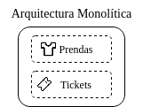
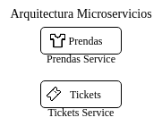

# Proyecto de cloud-CS3P02
## Integrantes
- Carlos Esteban Guerrero Robles

## Aplicación

Sistema de registro de envíos a lavandería.

### Origen

Fork de un proyecto personal disponible en el siguiente [repositorio](https://github.com/matapanchos/laundry-shipments-system).

### Características

La aplicación permite registrar varios tipos de prendas que el usuario posea.
A partir de la prendas registradas se permite llevar un manejo de que prendas se han llevado a un servicio de lavandería.

De esta forma se lleva un control de las prendas evitando así perder alguna al usar un servicio externo de lavado.

### Funcionalidad

Actualmente la aplicación se ejecuta mediante un CLI, a través del cual se puede realizar el agregado de nuevas prendas; así como el generado de tickets de registro.

Sin embargo, el sistema actualmente no posee un funcionalidad multiusuario para soportar el ingreso de prendas y tickets de parte de más de una persona en el mismo dispositivo.

### Arquitectura

La arquitectura actual de la aplicación es monolítica. Teniendo que realizar una instanciación para cada usuario.   
A continuación se muestra un diagrama de la arquitectura actual:

Sin embargo, como trabajo a futuro se puede realizar el cambio de arquitectura a una de micro-servicios.  
Con una arquitectura tentativa como la siguiente:

Para ello se puede optar por el framework [C++ Micro Services](https://cppmicroservices.org/).

### Topicos de nube

#### Contenedores

Para facilitar la instanciación de la aplicación se creó un dockerfile el cual permite crear facilmente varias instancias del programa disponible para cada uno de los usuarios.

#### Multi-tenancy

Cada instancia/usuario posee sus propias categorías de prendas creadas a preferencia y configuración del propietario.  
De esta forma se da la sensación de propiedad sin necesidad de cambiar el código del programa.

### Instanciación/Ejecución

Se dispone de un archivo [Makefile](Makefile) el cual puede ser ejecutando con el comando bash `make`\.  
Este proceso creara una carpeta target (laundry-shipments-system) donde se encontrará el ejecutable de la aplicación.  
Adicionalmente, para facilitar la "desinstalación" del programa se puede ejecutar `make clean` que se encargara de eliminar la carpeta target y su contenido (tickets y prendas generadas en el uso de la aplicación).

Así mismo para realizar la instanciación del proyecto como un contenedor primero deberemos construir la imagen docker mediante el comando `docker build -t laundry-shipments-system:1 .`  
Posteriormente instanciaremos un contenedor mediante el comando `docker run -dt laundry-shipments-system`
